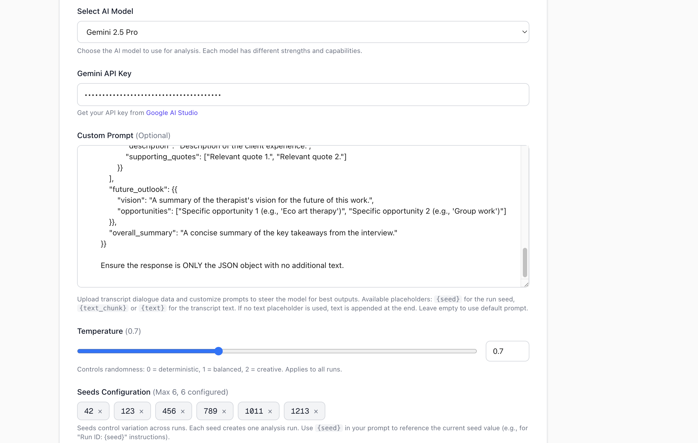
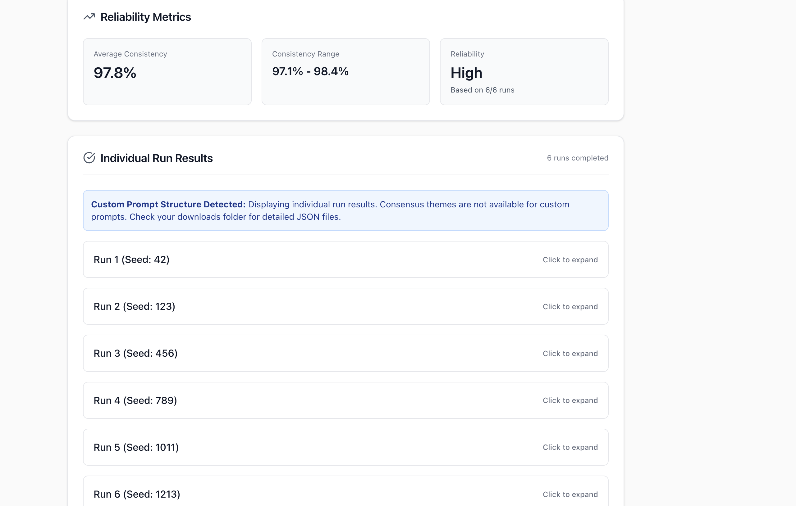

# Reliable Qualitative Thematic Analyzer

A comprehensive qualitative research analysis tool with comparative study powered by **Gemini 2.5 Pro, Claude 3.5 Sonnet, Azure GPT-4o, GPT-4o, Llama 3.2 90B, DeepSeek R1** and more via OpenRouter. Designed as a complementary tool to human-level qualitative research pipelines. This application performs multi-perspective multi-run thematic analysis with automatic reliability assessment using **Cohen's Kappa** and **Cosine Similarity**, comparison across multiple LLMs, and instant data export capabilities.

## 🎯 Overview

Created by **Aza Allsop and Nilesh Arnaiya at Aza Lab at Yale**, this tool provides:

- **Multi-LLM Support** - Compare results across Gemini, Claude, GPT-4o, Llama, DeepSeek
- **Multi-perspective analysis** with configurable runs (1-6) using customizable seeds
- **Dual reliability metrics** - Cohen's Kappa (κ) and Cosine Similarity with semantic embeddings
- **Configurable temperature** - Control randomness/creativity (0.0-2.0)
- **Custom prompts** - Full control with `{seed}` and `{text_chunk}` placeholders
- **Consensus themes** - Works with both default and custom prompt structures
- **Resume capability** - Continue from interrupted analyses
- **Comprehensive export options** - JSON, CSV, and formatted text reports

## 🚀 Key Features

### Core Analysis Engine
- **Multi-LLM Support**: 
  - **Direct APIs**: Gemini 2.5 Pro, Claude 3.5 Sonnet, Azure GPT-4o, GPT-4o, Groq Llama, DeepSeek Chat
  - **OpenRouter**: Claude, Llama 3.2 90B, DeepSeek R1 (unified API for multiple models)
- **Configurable Analysis Parameters**:
  - **Seeds**: 1-6 customizable seeds for reproducible variation
  - **Temperature**: 0.0-2.0 (deterministic to creative)
  - **Custom Prompts**: Full prompt control with variable substitution
- **Dual Reliability Metrics**: 
  - **Cohen's Kappa (κ)**: Inter-rater reliability measurement
  - **Cosine Similarity**: Semantic embedding-based comparison
- **Semantic Similarity**: Implements Hugging Face's `all-MiniLM-L6-v2` model for reliability scoring
- **Multi-Run Strategy**: Performs configurable independent analyses with different seeds
- **Intelligent Chunking**: Automatically splits large texts while preserving semantic boundaries

### Reliability & Quality Assurance
- **Dual Reliability Metrics**:
  - **Cohen's Kappa (κ)**: Statistical measure of inter-rater agreement accounting for chance
  - **Cosine Similarity**: Semantic comparison using transformer embeddings
- **Consensus Theme Identification**: 
  - Works with **both default and custom prompt structures**
  - Automatically extracts themes from any JSON structure
  - Identifies patterns across multiple runs
- **Adaptive Thresholds**: Adjusts consensus requirements based on completed runs
- **Graceful Degradation**: Works with partial results when some runs fail
- **Kappa Interpretation**: Automatic classification (almost perfect, substantial, moderate, fair, slight, poor)

### Supported LLM Providers

#### Direct API Integration
- **Google Gemini 2.5 Pro** - Latest multimodal model
- **Anthropic Claude 3.5 Sonnet** - Advanced reasoning capabilities
- **Azure OpenAI GPT-4o** - Enterprise-grade deployment
- **OpenAI GPT-4o** - Latest GPT model
- **Groq Llama 3 70B** - Fast inference
- **DeepSeek Chat** - Competitive performance


### LLM Provider Comparison

| Provider | Model | Best For | Speed | Cost | API Key Required |
|----------|-------|----------|-------|------|------------------|
| **Gemini 2.5 Pro** | Google | Balanced performance | Fast | Free tier | Google AI Studio |
| **Claude 3.5 Sonnet** | Anthropic | Deep reasoning | Medium | Paid | Anthropic |
| **Azure GPT-4o** | Microsoft | Enterprise | Fast | Paid | Azure Portal |
| **GPT-4o** | OpenAI | General purpose | Fast | Paid | OpenAI |
| **Llama 3 70B** | Groq | Fast inference | Very Fast | Free/Paid | Groq |
| **DeepSeek Chat** | DeepSeek | Cost-effective | Fast | Cheap | DeepSeek |
| **OpenRouter** | Multiple | Multi-model access | Varies | Cost-effective | OpenRouter |


## 🎨 Custom Prompts

### Variable Substitution
The tool supports dynamic placeholders in custom prompts:

- **`{seed}`** - Current run's seed value (e.g., 42, 123, 456)
- **`{text_chunk}`** or **`{text}`** - Transcript content

### Example Custom Prompt
```
Perform comprehensive thematic analysis on:

{text_chunk}

Analysis Parameters:
- Run ID: {seed}
- Focus: [Your specific research question]

Return JSON with your custom structure...
```

### Supported Structures
- **Default**: Pre-defined thematic analysis format
- **Custom**: Any valid JSON structure - consensus themes automatically extracted

## Screenshots





## 🛠 Technical Implementation

### Architecture Overview

```
┌─────────────────┐    ┌──────────────────┐    ┌─────────────────┐
│   File Upload   │───▶│  Text Processing │───▶│  Multi-Run      │
│   & Validation  │    │  & Chunking      │    │  Analysis       │
└─────────────────┘    └──────────────────┘    └─────────────────┘
                                                         │
┌─────────────────┐    ┌──────────────────┐    ┌─────────────────┐
│   Auto-Download │◀───│  Reliability     │◀───│  Semantic      │
│   & Export      │    │  Assessment      │    │  Similarity     │
└─────────────────┘    └──────────────────┘    └─────────────────┘
```

### Core Components

#### 1. Text Preprocessing (`preprocessText`)
```typescript
const preprocessText = (text: string) => {
  // Removes transcription artifacts, timestamps, and metadata
  // Calculates cleaning statistics for transparency
  // Returns cleaned text optimized for analysis
}
```

**Features:**
- Removes Otter.ai and other transcription service attributions
- Filters timestamp lines (00:00 format)
- Eliminates empty or very short lines
- Normalizes whitespace and formatting
- Provides detailed cleaning statistics

#### 2. Intelligent Text Chunking (`chunkText`)
```typescript
const chunkText = (text: string, maxChunkSize: number = 30000) => {
  // Respects paragraph boundaries
  // Falls back to sentence boundaries for large paragraphs
  // Only splits mid-sentence as last resort
}
```

**Strategy:**
1. **Paragraph Priority**: Attempts to keep paragraphs intact
2. **Sentence Fallback**: Splits oversized paragraphs by sentences
3. **Character Limit**: Enforces 30KB chunks for API efficiency
4. **Semantic Preservation**: Maintains context and meaning

#### 3. Gemini API Integration (`callGeminiAPI`)
```typescript
const callGeminiAPI = async (
  text: string, 
  seed: number, 
  isChunked: boolean = false, 
  chunkIndex: number = 0, 
  totalChunks: number = 1
) => {
  // Structured prompts for consistent JSON responses
  // Temperature variation based on seed for diversity
  // Robust error handling and retry logic
}
```

**Model Configuration:**
- **Model**: `gemini-2.5-pro` (latest version)
- **Temperature**: `0.7 + (seed % 100) / 200` (varies by run)
- **Max Tokens**: 8192 for comprehensive responses
- **Top-K**: 40, Top-P: 0.95 for balanced creativity/consistency

#### 4. Semantic Similarity Engine (`calculateSimilarity`)
```typescript
const calculateSimilarity = async (run1: any, run2: any) => {
  // Uses Hugging Face all-MiniLM-L6-v2 for embeddings
  // Calculates cosine similarity between theme vectors
  // Falls back to Jaccard similarity if model unavailable
}
```

**Implementation Details:**
- **Embedding Model**: `Xenova/all-MiniLM-L6-v2` (23MB, browser-cached)
- **Vector Operations**: Mean pooling of theme embeddings
- **Similarity Metric**: Cosine similarity between pooled vectors
- **Fallback Strategy**: Exact text matching if embeddings fail

#### 5. Multi-Run Analysis Orchestration (`analyzeText`)
```typescript
const analyzeText = async (text: string, seed: number, runNumber: number) => {
  // Handles both single-chunk and multi-chunk analyses
  // Merges results intelligently across chunks
  // Provides accurate progress reporting
}
```

**Chunk Processing:**
- **Single Chunk**: Direct analysis path
- **Multi-Chunk**: Independent analysis + intelligent merging
- **Theme Deduplication**: Combines duplicate themes by name
- **Evidence Aggregation**: Collects unique evidence quotes
- **Sentiment Averaging**: Calculates mean sentiment scores

#### 6. Reliability Assessment (`synthesizeResults`)
```typescript
const synthesizeResults = async (allRuns: any[]) => {
  // Calculates inter-run similarities
  // Identifies consensus themes
  // Provides reliability metrics and warnings
}
```

**Data Persistence:**
- **Format**: JSON with metadata (timestamp, seed, themes, patterns)
- **Naming**: `run_{number}_{filename}_{date}.json`
- **Content**: Complete analysis results + file statistics
- **Recovery**: Enables manual review of individual runs

### State Management

#### React State Structure
```typescript
// Core Analysis State
const [apiKey, setApiKey] = useState('');
const [file, setFile] = useState(null);
const [status, setStatus] = useState('idle');
const [progress, setProgress] = useState(0);
const [currentRun, setCurrentRun] = useState(0);

// Results & Reliability
const [results, setResults] = useState(null);
const [partialResults, setPartialResults] = useState(null);
const [completedRuns, setCompletedRuns] = useState([]);

// Processing Statistics
const [fileStats, setFileStats] = useState(null);
const [cleaningStats, setCleaningStats] = useState<any>(null);

// Semantic Analysis
const extractorRef = useRef(null as any);
const [extractorReady, setExtractorReady] = useState(false);
```

#### Configuration Constants
```typescript
const MAX_RETRIES = 3;
const RETRY_DELAY_BASE = 1500;
const TOTAL_RUNS = seeds.length; // Dynamic: 1-6 runs
const SEEDS = [42, 123, 456, 789, 1011, 1213]; // User-configurable

// User-adjustable parameters
const [seeds, setSeeds] = useState([42, 123, 456, 789, 1011, 1213]);
const [temperature, setTemperature] = useState(0.7);
const [customPrompt, setCustomPrompt] = useState('');
```

### API Integration Details

#### Gemini API Endpoint
```
https://generativelanguage.googleapis.com/v1beta/models/gemini-2.5-pro:generateContent?key={API_KEY}
```

#### Request Structure
```json
{
  "contents": [{"parts": [{"text": "prompt"}]}],
  "generationConfig": {
    "temperature": 0.7,
    "topK": 40,
    "topP": 0.95,
    "maxOutputTokens": 8192
  }
}
```

#### Expected Response Format
```json
{
  "majorEmotionalThemes": [
    {
      "theme": "Theme Name",
      "description": "Detailed description",
      "sentiment": "positive|negative|neutral",
      "frequency": 15,
      "evidence": ["example 1", "example 2"]
    }
  ],
  "emotionalPatterns": {
    "dominantTone": "word",
    "overallSentiment": 0.75,
    "narrativeArc": "description"
  },
  "keyInsights": ["insight 1", "insight 2"]
}
```

## 📊 Reliability Metrics

### 1. Cohen's Kappa (κ) - Inter-Rater Reliability
- **Method**: Statistical measure accounting for chance agreement
- **Range**: -1 to 1 (negative = worse than chance, 1 = perfect agreement)
- **Interpretation**:
  - **κ > 0.80**: Almost perfect agreement
  - **κ 0.60-0.80**: Substantial agreement
  - **κ 0.40-0.60**: Moderate agreement
  - **κ 0.20-0.40**: Fair agreement
  - **κ < 0.20**: Slight or poor agreement
- **Application**: Measures consistency of theme identification across runs

### 2. Cosine Similarity - Semantic Consistency
- **Method**: Semantic similarity using transformer embeddings (all-MiniLM-L6-v2)
- **Range**: 0-1 (0% = no similarity, 100% = identical themes)
- **Interpretation**:
  - **High (>70%)**: Strong thematic convergence
  - **Moderate (50-70%)**: Reasonable consistency with variation
  - **Low (<50%)**: Considerable analytical divergence
- **Application**: Evaluates semantic overlap of themes

### 3. Consensus Theme Identification
- **Threshold**: Themes appearing in ≥50% of runs
- **Ranking**: By consistency percentage
- **Evidence**: Supporting quotes from all occurrences
- **Adaptive**: Adjusts for partial data sets
- **Structure Agnostic**: Works with default and custom prompt structures

## 🔧 Setup & Installation

### Prerequisites
- Node.js 18+ 
- npm or pnpm package manager
- API key from at least one provider (see below)

### API Keys (Get from respective platforms)
- **Gemini**: [Google AI Studio](https://makersuite.google.com/app/apikey)
- **Claude**: [Anthropic Console](https://console.anthropic.com/)
- **Azure OpenAI**: [Azure Portal](https://portal.azure.com)
- **OpenAI**: [OpenAI Platform](https://platform.openai.com/api-keys)
- **Groq**: [Groq Console](https://console.groq.com/keys)
- **DeepSeek**: [DeepSeek Platform](https://platform.deepseek.com/api_keys)
- **OpenRouter**: [OpenRouter](https://openrouter.ai/keys) (One key for Claude, Llama, DeepSeek)

### Installation
```bash
# Clone repository
git clone https://github.com/NileshArnaiya/LLM-Thematic-Analysis-Tool.git
cd LLM-Thematic-Analysis-Tool

# Install dependencies
npm install
# or
pnpm install

# Development server
npm run dev
# or
pnpm dev

# Production build
npm run build
# or
pnpm build
```


## ⚡ Latest Improvements (v2.0)

### New Features
- ✅ **Cohen's Kappa** - Statistical inter-rater reliability metric
- ✅ **Multi-LLM Support** - 9+ models (Gemini, Claude, GPT-4o, Llama, DeepSeek)
- ✅ **OpenRouter Integration** - Unified API for multiple models
- ✅ **Azure OpenAI** - Enterprise deployment support
- ✅ **Dynamic Seeds** - Configurable 1-6 seeds with UI management
- ✅ **Temperature Control** - Adjustable 0.0-2.0 with slider
- ✅ **Custom Prompts** - Variable substitution (`{seed}`, `{text_chunk}`)
- ✅ **Universal Consensus** - Works with any JSON structure
- ✅ **Modern UI** - Gradient design with glassmorphism
- ✅ **Enhanced Debugging** - Detailed console logging and error messages


## 📝 Usage Examples

### Basic Analysis Workflow
1. **Select Model**: Choose from Gemini, Claude, GPT-4o, Llama, DeepSeek, or OpenRouter
2. **Enter API Key**: Input your API key for the selected provider
3. **Configure Analysis** (Optional):
   - Adjust **temperature** (0.0 = deterministic, 2.0 = creative)
   - Modify **seeds** (add/remove for different run variations)
   - Write **custom prompt** using `{seed}` and `{text_chunk}` placeholders
4. **Upload**: Drag and drop a .txt file
5. **Analyze**: Click "Start Analysis" 
6. **Monitor**: Watch real-time animated progress with detailed status
7. **Review**: Examine reliability metrics (Kappa + Cosine) and consensus themes
8. **Export**: Download results in JSON, CSV, or formatted text

### Advanced Features
- **Multi-LLM Comparison**: Run same text across different models and compare results
- **Custom Prompts**: Full control over analysis structure and output format
- **Dynamic Seeds**: Configure 1-6 seeds for reproducibility testing
- **Temperature Control**: Fine-tune creativity vs. consistency
- **Resume**: Continue interrupted analyses from last successful run
- **Partial Results**: Review completed runs during processing
- **Custom Structures**: Automatic consensus extraction from any JSON format

## 🔬 Research Applications

### Qualitative Research
- **Interview Analysis**: Process transcribed interviews
- **Focus Group Data**: Analyze group discussion transcripts
- **Survey Responses**: Extract themes from open-ended responses
- **Case Studies**: Identify patterns in narrative data

### Academic Use Cases
- **Literature Reviews**: Synthesize themes across papers
- **Content Analysis**: Analyze media or document collections
- **Ethnographic Research**: Process field notes and observations
- **Mixed Methods**: Complement quantitative findings

## 🤝 Contributing

### Development Guidelines
- **Code Style**: Follow existing patterns and conventions
- **Testing**: Test with various file sizes and formats

### Feature Requests & Roadmap

#### Completed Features ✅
- ✅ Multiple LLM support (9+ models)
- ✅ Cohen's Kappa reliability metric
- ✅ Dynamic seed configuration
- ✅ Temperature control
- ✅ Custom prompt support
- ✅ BATCH Processing of files
- ✅ CSV export format
- ✅ Consensus themes for custom structures

#### Planned Features 🚀
- **Additional Models**: Mistral, Cohere, AI21, Olmo (Coming soon)
- **Advanced Analytics**: 
  - Fleiss' Kappa for multi-rater agreement
  - Krippendorff's Alpha for ordinal data
  - Inter-coder reliability visualization
    
- **UI Improvements**:
  - Interactive theme visualization graphs
  - Side-by-side LLM comparison view
  - Real-time collaborative analysis
- **Research Tools**:
  - Citation extraction and management (With Bibby AI at trybibby.com)
  - Integration with reference managers with zotero or Bibby 


## Citing ThemeLLM

If you use ThemeLLM in your research, please use the following BibTeX entry.

```bibtex
@article{azaNilesh2025,
  title={ThemeLLM: Reliable Multi-Perspective Thematic Analysis via LLM
Ensemble Validation: A Cross-Validation Approach to
Qualitative Research},
  author={Aza Allsop, Nilesh Jain},
  journal={arXiv preprint arXiv:2408.0071114},
  url={https://arxiv.org/abs/2408.00712114},
  year={2025}
}
```

## 📄 License
With help from Bibby AI - Latex Writing tool for academics
This project is developed by Aza Lab at Yale for qualitative research applications. Please contact Dr. Aza Allsop and Researcher Nilesh Arnaiya for commercial academic licensing and usage permissions.

## 🆘 Support

For technical support, feature requests, or research collaboration:
- **Contact**: Aza Allsop and Nilesh Arnaiya at Aza Lab at Yale university
- **Issues**: Report bugs and request features via GitHub issues
- **Documentation**: Refer to inline code comments for implementation details
---

*Built with ❤️ by Nilesh for the qualitative research community*
